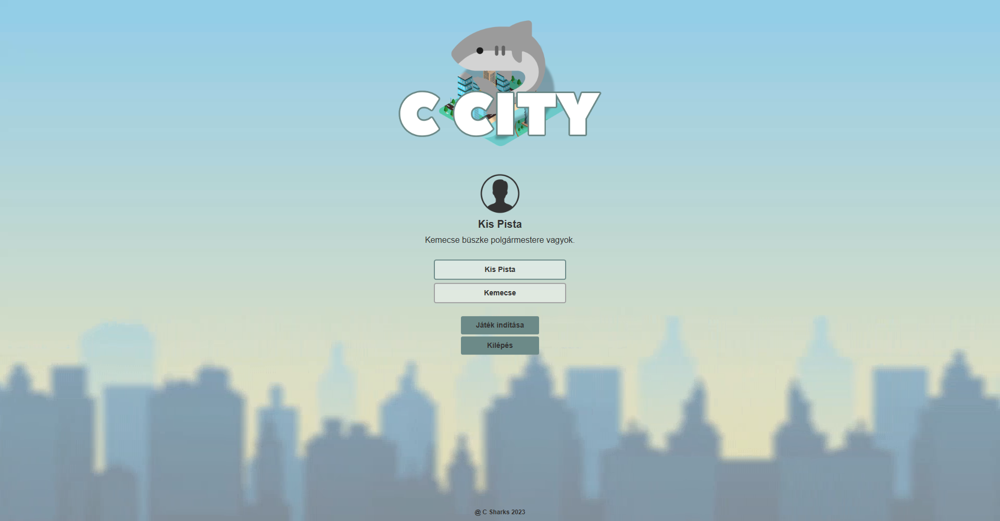
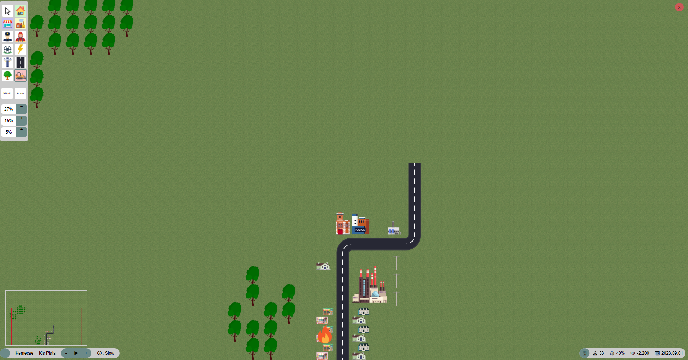
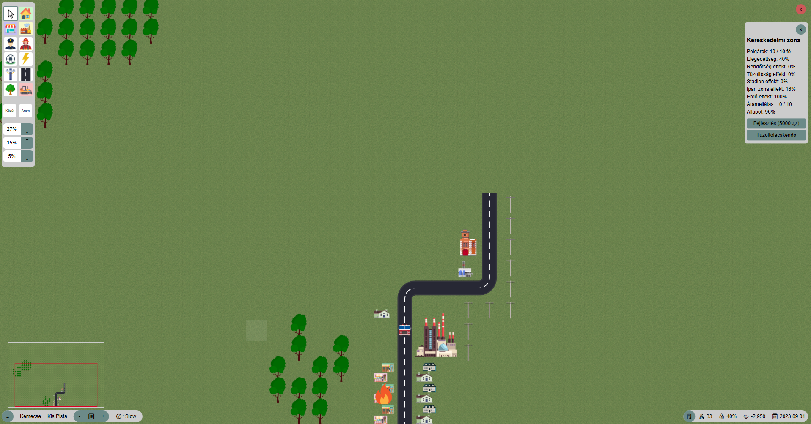
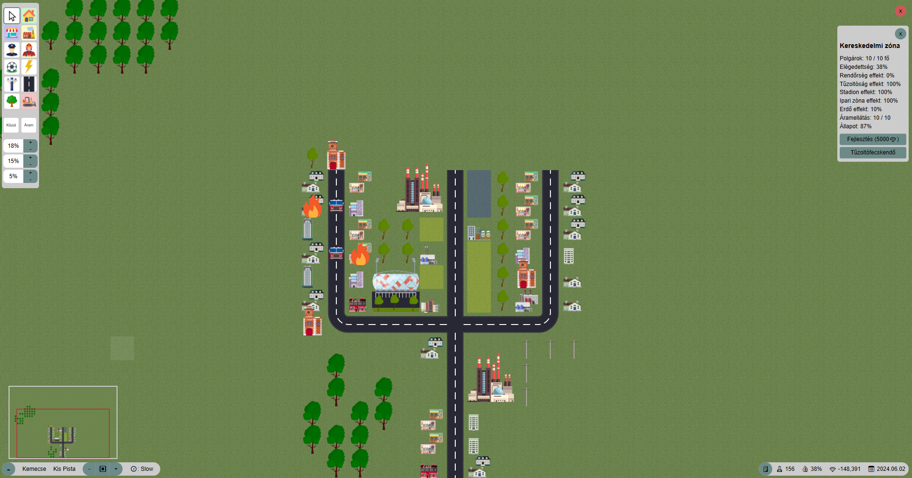
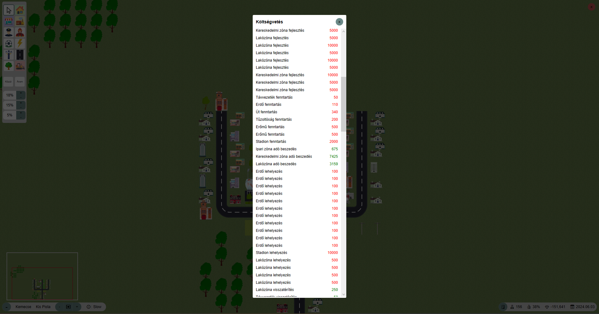

# C City

## Bevezetés

A C City egy egyjátékos, valós idejű város építő szimulátor, ahol a játékos felépítheti a saját városát és menedzselheti polgármesterként. A játék célja, hogy a játékos egy virágzó várost hozzon létre, aminek a költségvetése kiegyensúlyozott és boldogok a polgárok.

## Mit tud tenni a játékos?

- Építhet:
  - Új lakó- , ipari- vagy szolgáltatás zónát
  - Összekötő utakat
  - Villany vezetéket
  - Kiszolgáló épületeket
- Megtekintheti:
  - Egyes zónák statisztikáját
  - A város statisztikáját
- Az adó mértékén állíthat
- Zónákat fejleszthet

## Miket tud építeni a játékos?

- Lakó-, ipari- és szolgáltatás zónákat
- Összekötő utakat
- Villany vezetéket
- Rendőrséget
- Tűzoltóságot
- Erőművet
- Stadiont
- Erdőket

Az egyes épületek különböző hatással vannak a városra, illetve közvetlen környezetükre. Pl. a stadion megnöveli a körülötte lakó/dolgozó polgárok elégedettségét, a rendőrség épülete pedig a biztonságérzetet növeli. Ezek mind az elégedettség javításához vezetnek. Természetesen egy épület negatív hatással is lehet a körülötte lévő mezőkre. Ilyen pl. az ipari zóna. Ezen hatásokat erdők építésével lehet redukálni, leárnyékolni. Egy épület (az erdőt leszámítva természetesen) **csak akkor fejti ki hatását, ha közútról elérhető.**

## A polgárok

Minden hónap elején a város mutatóitól függően (elégedettség, adósság, stb.) polgárok költöznek be a városba. Minden polgár a lehető legközelebbi munkahelyen vállal munkát. Fontos, hogy a polgárok **csak olyan zónába költöznek be / vállalnak munkát**, amely **áramellátás alatt van, illetve közútról elérhető**. A város minden polgára rendelkezik egy elégedettségi mutatóval, amelyet pozitívan befolyásolnak a következő tényezők:
- alacsony adók;
- lakóhelyhez közeli munkahely;
- lakóhelyhez nincsen közel ipari épület;
- lakóhely és munkahely közbiztonsága (amely a népesség növekedésével arányosan egyre súlyosabb szempont).

Negatívan befolyásolják az elégedettséget a következő tényezők:

- a fenti pozitív tényezők ellentétei;
- ha a város negatív büdzsével rendelkezik (hitelből működik), ez a faktor legyen arányos azzal,
hogy mekkora hitelről van szó és hány éve negatív a büdzsé;
- ha kiegyensúlyozatlan a városban a szolgáltatások és az ipari termelés aránya.

**Amennyiben a teljes város elégedettsége kritikusan alacsonnyá válik, leváltják a polgármestert és a játékos vesztett**

## Közút és áramellátás

A játék kezdetekor, a pálya alján egy épített út mező található. A játék folyamán **azok az utak minősülnek közútnak, amelyek elérhetőek a kezdő út mezőről.**. A kezdő út mező kivételével az utak elbonthatók abban az esetben, amennyiben egy korábban már felépített épület a rombolás hatására nem válna közútról elérhetetlenné.

A városban minden épületnek áramellátásra van szüksége. **Az erőmű a vele szomszédos mezőket látja el árammal**, amennyiben azok zóna mezők vagy kiszolgáló épületek. Minden zóna mező és kiszolgáló épület automatikusan rendelkezik épített elektromos hálózattal az áramszolgáltatás továbbítására, így az **tovább terjed az összefüggő zónákból és kiszolgáló épületekből álló területen**. Nem összefüggő területek között **magasfeszültségű távvezeték építésével továbbítható az áramszolgáltatás**, ezen mezőkre más nem építhető ez esetben. Az utcákon (1 egységnyi úton) is automatikusan tovább terjed az áramellátás.

## Képek

